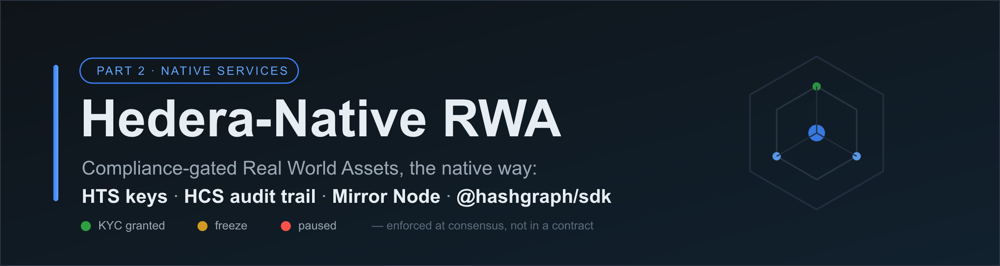
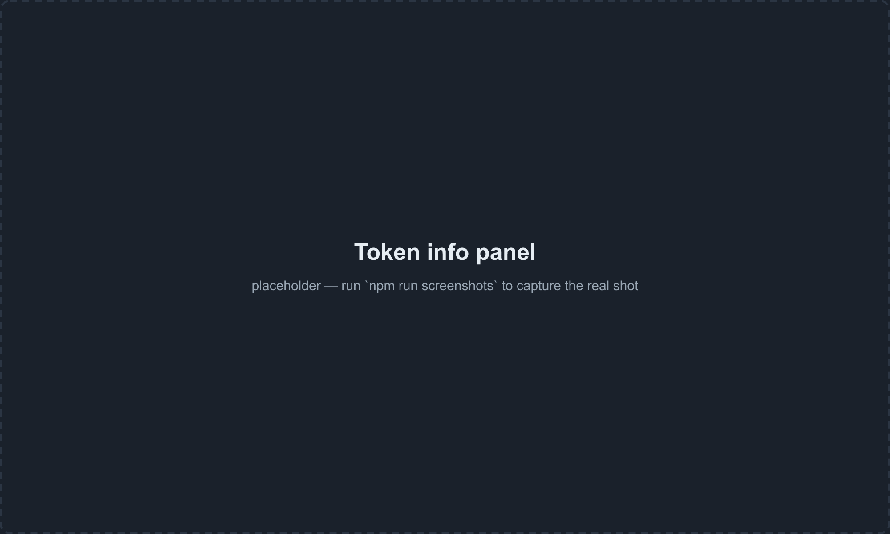
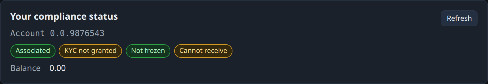
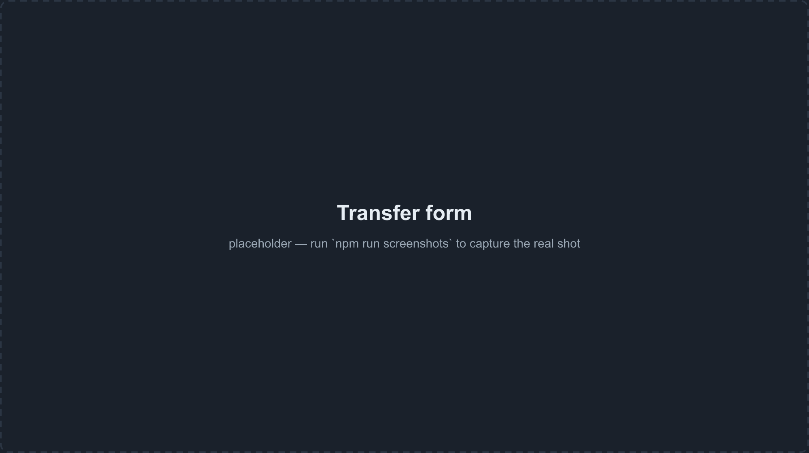
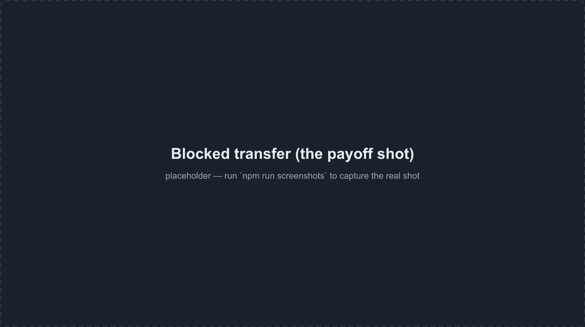

# Hedera-Native RWA — Part 2: Compliance Without a Contract

> Build a compliance-gated Real World Asset token using **Hedera's native services** —
> HTS token keys, HCS audit trail, Mirror Node reads, and `@hashgraph/sdk` — as a
> deliberate contrast to Part 1's Solidity approach. Every concept you wrote a contract
> for in Part 1 is a first-class network primitive here.



<p align="center">
  <a href="#license"></a>
  
  
  
  
  
  
  
</p>

---

## Part 2 of 2 — The Native Contrast

**[Part 1](https://github.com/kbennett2000/hedera-first-rwa-dapp)** built a compliance-gated RWA token by treating Hedera as an EVM chain: a hand-written `ComplianceRegistry.sol`, an OpenZeppelin `_update` hook, viem/wagmi, MetaMask. It is a great on-ramp for Solidity developers.

This repo builds **the same product using Hedera's native services**. The one-line hook:

> *In Part 1 you wrote a whole contract to reinvent a KYC gate. On Hedera, KYC is a native key on the token, and the consensus layer enforces it.*

The two repos exist to sit side-by-side. As you read Part 2, you constantly see "the network does this for me."

---

## Demo

The screenshots below were captured from the app in its dev-only demo mode with **simulated Mirror Node responses** (see ADR-0010) — no live deployment backs them. Run the [Quickstart](#6-quickstart) to see the same panels with live Mirror data from your own token and topic.

After the Quickstart, view your own entities on HashScan: `https://hashscan.io/testnet/token/<your-tokenId>` and `https://hashscan.io/testnet/topic/<your-topicId>` (ids from your `deployments.json`).

**Token Info** — needs no wallet; simulated Mirror data in this capture:



> There is no bundled live deployment — minting, granting KYC, and the other admin operations run against your own deploy with your own operator key. The [Quickstart](#6-quickstart) covers the full flow.

---

## The Rosetta Stone — Part 1 to Part 2

The pedagogical centerpiece. Every Part 1 concept maps to a Hedera-native equivalent.

| Part 1 (EVM / Solidity) | Part 2 (Hedera-native) |
|---|---|
| `ComplianceRegistry.sol` whitelist mapping | Token `kycKey` + `TokenGrantKyc` / `TokenRevokeKyc` |
| `_update` hook reverts non-compliant transfer | Network rejects the transfer at consensus |
| Owner-only `mint` | `supplyKey` + `TokenMintTransaction` |
| *(no equivalent)* | **Token association** — an account must associate before holding |
| *(not in Part 1)* | Native **freeze** / **wipe** (clawback) / **pause** |
| Solidity `event` logs | **HCS topic** messages (consensus-ordered audit trail) |
| `wagmi` / `viem` `useReadContract` | **Mirror Node** REST |
| MetaMask (EVM signing only) | **Hedera WalletConnect** → HashPack |
| Hardhat `deploy.ts` | SDK script `src/scripts/01-create-token.ts` |
| HashIO JSON-RPC relay | `@hashgraph/sdk` over gRPC + Mirror Node REST |
| Custom errors / `unchecked` for gas | USD-denominated, predictable fees (a different cost model) |

---

## Tech Stack

| Layer | Tools |
|---|---|
| SDK / writes | `@hashgraph/sdk` ^2.81.0 over gRPC |
| Reads | Hedera Mirror Node REST (`fetch`) |
| Validation | Zod ^4 |
| Language | TypeScript strict, Node ≥ 22, ES modules |
| Frontend | React 18 · Vite 6 · `@hashgraph/hedera-wallet-connect` ^1.3.4 · HashPack |
| Tests | Vitest ^4 (424 unit + 40 frontend, zero network) |
| Lint / format | ESLint ^10 · Prettier ^3 |
| Scripts | `tsx` (runs `.ts` directly) |
| CI | GitHub Actions (typecheck + lint + unit tests; no network) |

---

## Table of Contents

1. [What You'll Build](#1-what-youll-build)
2. [Key Concepts](#2-key-concepts)
3. [Project Structure](#3-project-structure)
4. [Prerequisites](#4-prerequisites)
5. [Environment Setup](#5-environment-setup)
6. [Quickstart](#6-quickstart)
7. [How the Compliance Gate Works](#7-how-the-compliance-gate-works)
8. [Architecture and ADR Index](#8-architecture-and-adr-index)
9. [Testing](#9-testing)
10. [Hedera-Native Specifics and Local Node Note](#10-hedera-native-specifics-and-local-node-note)
11. [Troubleshooting](#11-troubleshooting)
12. [Going Further](#12-going-further)
13. [Contributing](#13-contributing)
14. [License](#14-license)

---

## 1. What You'll Build

```
┌────────────────────────────────────────────────────────────────┐
│              React Frontend (investor-facing)                  │
│  Connect HashPack · Token Info · Associate · Compliance Status │
│  Transfer · Audit Trail (HCS feed, consensus-ordered)          │
└──────────┬──────────────────────────────────┬──────────────────┘
           │ WalletConnect (signing)           │ REST (reads, no wallet)
           ▼                                   ▼
┌─────────────────────┐            ┌──────────────────────────────┐
│ Hedera Consensus    │            │ Hedera Mirror Node           │
│ Nodes (gRPC via     │            │ (free REST — token info,     │
│ @hashgraph/sdk)     │            │  accounts, topic messages)   │
│                     │            └──────────────────────────────┘
│ HTS token keys:     │
│  kyc · freeze · wipe│            ┌──────────────────────────────┐
│  pause · supply ·   │◄───────────│ Issuer CLI (SDK scripts)     │
│  admin              │            │ create · grantKyc · mint ·   │
│ HCS topic (audit)   │◄───────────│ freeze · wipe · pause        │
└─────────────────────┘            └──────────────────────────────┘
```

**What makes this different from Part 1:**
- No smart contract — the network enforces compliance through native token keys
- Transfers to non-KYC'd recipients are rejected at consensus, not by a Solidity revert
- The audit trail is a first-class HCS topic, consensus-ordered and free to query
- MetaMask cannot sign these transactions — you use a Hedera wallet (HashPack)

---

## 2. Key Concepts

### So What???

Why does any of this matter? By going through this module you will have SUCCESSFULLY:

- Created a compliance-gated RWA token using **native Hedera token keys** — zero Solidity
- Ran an investor flow: associate → receive tokens → attempt a blocked transfer → see the real network rejection code → grant KYC → retry and succeed
- Read a live **HCS audit trail**: every compliance action written to a consensus-ordered message stream
- Built a full-stack TypeScript app with a clean core/sdk separation that keeps 424 unit tests fast and network-free
- Produced a working, portfolio-ready dApp that demonstrates how native Hedera services replace an entire compliance contract

### Native HTS Compliance Keys

An HTS token is a network entity configured with optional keys, each unlocking a capability:

| Key | What it unlocks |
|---|---|
| `kycKey` | Grant / revoke KYC per account — the whitelist, native-default-deny |
| `freezeKey` | Place / lift a legal hold on an account's balance |
| `wipeKey` | Clawback — remove tokens from a non-treasury account |
| `pauseKey` | Emergency halt — suspend all transfers for the token |
| `supplyKey` | Mint new tokens |
| `adminKey` | Rotate any of the above keys |

A token created with a `kycKey` defaults every account to KYC-revoked. You do not write this logic; the network enforces it. The `ComplianceRegistry.sol` from Part 1 is gone.

### Token Association

On Hedera an account must **associate** with a token before it can hold a balance. There is no EVM equivalent. This is the biggest new idea for a Part 1 reader.

The flow is: associate → issuer grants KYC → account can receive tokens.

### HCS Audit Trail

The Hedera Consensus Service gives an ordered, timestamped, tamper-evident message stream. One topic per token; every compliance action submits a structured JSON message. The frontend reads the feed via Mirror Node and renders it newest-first, sorted by **consensus timestamp** (not the issuer-asserted `ts` field). This replaces Part 1's Solidity event logs — with no indexer needed.

### Mirror Node — Free Reads

Free REST mirror of network state. Token info, per-account KYC/freeze status, balances, and the audit feed are plain HTTP GETs against `https://testnet.mirrornode.hedera.com`. No indexer, no subgraph, no custom event handler.

### Why MetaMask Can't Sign These Transactions

Native HTS transactions are not EVM transactions. MetaMask is an EVM wallet; it has no concept of `TokenAssociateTransaction` or `TransferTransaction` for an `0.0.x` token. You need a Hedera wallet — this dApp uses **HashPack** via Hedera WalletConnect. This is a real constraint, not a workaround. It is why there is a teaching banner at the top of the app: *"MetaMask can't sign these — this app connects a Hedera wallet (HashPack) via WalletConnect."*

---

## 3. Project Structure

```
hedera-native-rwa-dapp/
│
├── src/
│   ├── core/                   PURE LOGIC — no network, unit-tested
│   │   ├── schema/             HCS audit message schema (Zod) + encode/decode/validate
│   │   ├── mirror/             Mirror Node response types + bigint-safe JSON parser
│   │   ├── compliance/         State derivation: Mirror payload → {kyc, frozen, paused, canReceive}
│   │   └── tx/                 Transaction-argument builders (produce params; never execute)
│   │
│   ├── sdk/                    THIN EXECUTION LAYER — touches the network
│   │   ├── client.ts           Operator Client setup
│   │   ├── mirrorClient.ts     HTTP wrapper (fetch text → core parser, never JSON.parse)
│   │   ├── deployments.ts      Read/write deployments.json
│   │   └── operations/         execute(): createToken, createTopic, grantKyc, revokeKyc,
│   │                           mint, freeze, wipe, pause, submitAuditMessage
│   │
│   └── scripts/                ISSUER CLI ENTRYPOINTS
│       ├── _runner.ts          Shared bootstrap (env load, operator client, audit helper)
│       ├── 01-create-token.ts
│       ├── 02-create-audit-topic.ts
│       ├── 03-grant-kyc.ts
│       ├── 04-revoke-kyc.ts
│       ├── 05-mint.ts
│       ├── 06-freeze.ts        (--unfreeze flag)
│       ├── 07-wipe.ts
│       └── 08-pause.ts         (--unpause flag)
│
├── frontend/                   React + Vite — investor-facing
│   └── src/
│       ├── components/         Header, TokenInfoPanel, ComplianceStatusPanel,
│       │                       AssociateCard, TransferCard, AuditTrailPanel
│       ├── actions/            associate.ts, transfer.ts — wallet-signed actions
│       ├── mirror/             hooks.ts (useMirrorResource, useTokenInfo, useAuditFeed…)
│       ├── view/               Pure display logic (compliance badges, format, audit decode)
│       ├── wallet/             WalletContext, useWallet — DAppConnector/DAppSigner wrapper
│       └── config.ts           Reads VITE_* env vars; validates at startup
│
├── test/
│   ├── unit/                   npm test — pure core logic, zero network, <10s
│   └── integration/            npm run test:integration — testnet, on demand, not in CI
│
├── docs/
│   ├── SPEC.md                 Design spec and architecture (intent document)
│   ├── hcs-audit-schema.md     HCS message schema reference
│   ├── adr/                    Architecture Decision Records (ADR-0001 through ADR-0010)
│   └── images/                 banner.png, screenshots
│
├── deployments.example.json    Shape reference — {tokenId, topicId, operatorId}
├── deployments.json            YOUR local ids after running the scripts (gitignored)
├── .env.example                Root env template (operator credentials)
├── frontend/.env.example       Frontend env template (VITE_* vars)
└── contracts/                  Optional hybrid module (HTS via 0x167 — final cycle, not built)
```

---

## 4. Prerequisites

| Tool | Version | Notes |
|---|---|---|
| Node.js | **≥ 22** | Required — the bigint-safe Mirror Node parser uses V8 source-text access, which shipped in Node 22 LTS. The dApp throws an explicit error rather than silently truncating large balances on older runtimes. |
| npm | ≥ 10 | Comes with Node 22 |
| Git | Any | [git-scm.com](https://git-scm.com) |
| Hedera testnet account | Funded | Create at [portal.hedera.com](https://portal.hedera.com). You need an **account ID** (`0.0.x`) and an **ECDSA private key**. An ECDSA key is recommended — it is forward-compatible with the optional hybrid HTS-via-EVM module. |
| HashPack wallet | Latest | [hashpack.app](https://www.hashpack.app) — browser extension. You need a testnet account loaded into it for the investor flow. |
| WalletConnect project id | — | Register a free project at [cloud.walletconnect.com](https://cloud.walletconnect.com) and copy the project id. Required for the frontend to open the connect modal. |

You do **not** need Hardhat, Solidity, or MetaMask. There are no smart contracts to compile.

---

## 5. Environment Setup

### Root `.env` (operator / issuer tooling)

```bash
cp .env.example .env
```

Open `.env` and fill in your testnet operator:

```bash
# Hedera operator credentials — issuer/admin scripts only. NEVER commit this file.
OPERATOR_ID=0.0.1234567
OPERATOR_KEY=302e...          # ECDSA private key (hex DER)

HEDERA_NETWORK=testnet
MIRROR_NODE_URL=https://testnet.mirrornode.hedera.com
```

### Frontend `frontend/.env`

```bash
cp frontend/.env.example frontend/.env
```

```bash
# WalletConnect Cloud project id — required for the connect modal.
VITE_WALLETCONNECT_PROJECT_ID=your_project_id_here

# Network + Mirror Node.
VITE_HEDERA_NETWORK=testnet
VITE_MIRROR_NODE_URL=https://testnet.mirrornode.hedera.com

# Set these AFTER running scripts 01 and 02 (values come from deployments.json).
VITE_TOKEN_ID=
VITE_TOPIC_ID=
```

Leave `VITE_TOKEN_ID` and `VITE_TOPIC_ID` blank for now — you will fill them in during the Quickstart after the issuer scripts create the entities.

---

## 6. Quickstart

By the end of this section you will have a token on Hedera testnet, an HCS audit topic, and a running frontend that connects HashPack, associates, attempts a blocked transfer, grants KYC, and retries successfully.

### Step 1 — Clone and install

```bash
git clone https://github.com/kbennett2000/hedera-native-rwa-dapp.git
cd hedera-native-rwa-dapp

npm install
npm run build          # compiles core/ + sdk/ to dist/ — the frontend consumes this
```

Complete [Environment Setup](#5-environment-setup) before continuing.

### Step 2 — Create the token

```bash
npx tsx src/scripts/01-create-token.ts
# Optional custom name/symbol:
# npx tsx src/scripts/01-create-token.ts "Acme RWA" ARWA
```

Sample output:

```
[01-create-token] info: token created { tokenId: '0.0.5821234', name: 'Acme RWA', symbol: 'ARWA', treasury: '0.0.1234567' }
[01-create-token] info: next: run 02-create-audit-topic to create the HCS topic and record TOKEN_CREATED
```

`deployments.json` is created (or updated) with your `tokenId` and `operatorId`.

### Step 3 — Create the audit topic

```bash
npx tsx src/scripts/02-create-audit-topic.ts
```

Sample output:

```
[02-create-audit-topic] info: audit topic created { topicId: '0.0.5821235', tokenId: '0.0.5821234' }
[02-create-audit-topic] info: audit message submitted { type: 'TOPIC_CREATED', sequenceNumber: 1 }
[02-create-audit-topic] info: recorded TOPIC_CREATED and backfilled TOKEN_CREATED
[02-create-audit-topic] info: audit message submitted { type: 'TOKEN_CREATED', sequenceNumber: 2 }
```

Your `deployments.json` now looks like:

```json
{
  "tokenId": "0.0.5821234",
  "topicId": "0.0.5821235",
  "operatorId": "0.0.1234567"
}
```

### Step 4 — Configure and start the frontend

Copy the ids from `deployments.json` into `frontend/.env`:

```bash
VITE_TOKEN_ID=0.0.5821234
VITE_TOPIC_ID=0.0.5821235
```

Then install and start:

```bash
cd frontend
npm install
npm run dev
```

The `predev` script automatically rebuilds `dist/` from root before Vite starts, so a fresh clone always has a valid core artifact. Open [`http://localhost:5173`](http://localhost:5173).

### Step 5 — Connect HashPack

Click **Connect HashPack** in the top-right. The WalletConnect modal opens. Scan with HashPack or select it from the list. After connecting your account ID (`0.0.x`) appears in the header.


> This screenshot was captured using the app's dev-only demo mode (see ADR-0010). Mirror reads in this capture are simulated fixture responses validated against the same parsers the app uses; with your own deployment they are live testnet reads.

### Step 6 — Associate with the token

The **Associate** card will show until your account is associated. Click **Associate** and approve in HashPack.


> Captured via demo mode. The `TokenAssociateTransaction` is a native HTS transaction — MetaMask cannot sign this.

After the Mirror Node reflects the association (~5 seconds), the compliance status panel updates.

**Compliance status** — read from Mirror for the connected account (simulated data in this capture):



> Demo-mode capture with simulated Mirror data. This panel requires no signing; with a real deployment it shows live Mirror state.

You will see: Associated: yes · KYC: not granted · Frozen: no · Can receive: no.

### Step 7 — Attempt a transfer to a non-KYC'd account

Fill in any testnet account ID that has not been granted KYC as the recipient. Click **Transfer**.



> Captured via demo mode with simulated data — nothing is submitted. Outside demo mode, the transfer signs with your connected wallet and submits to testnet.

The network rejects the transfer:



> **This is the payoff.** Captured via demo mode; the rejection code `ACCOUNT_KYC_NOT_GRANTED_FOR_TOKEN` is the **real** Hedera network status a transfer to a non-KYC'd recipient produces — run the Quickstart to reproduce it live. The network enforces the KYC gate — no Solidity revert, no contract, no custom logic. The `ReceiptStatusError` propagates from the SDK through the frontend action and is displayed verbatim.

In Part 1, this rejection came from:

```solidity
function _update(address from, address to, uint256 value) internal override {
    if (!complianceRegistry.isApproved(to)) revert RecipientNotCompliant(to);
    ...
}
```

In Part 2, you wrote zero contract code. The token's `kycKey` did the work.

### Step 8 — Grant KYC (issuer action)

Back in your terminal, grant KYC to the recipient account:

```bash
npx tsx src/scripts/03-grant-kyc.ts 0.0.<recipient-account-id>
```

Sample output:

```
[03-grant-kyc] info: kyc granted { tokenId: '0.0.5821234', accountId: '0.0.9876543', status: 'SUCCESS' }
[03-grant-kyc] info: audit message submitted { type: 'KYC_GRANTED', sequenceNumber: 3 }
```

### Step 9 — Retry the transfer — it succeeds

Go back to the frontend, enter the same recipient, and click **Transfer** again. This time it succeeds (`SUCCESS`). The balance panel updates after the Mirror Node reflects the change.

### Step 10 — Inspect the audit trail

Scroll to the **Audit Trail** panel. It reads the HCS topic via Mirror Node and shows every compliance event in consensus-timestamp order — `TOKEN_CREATED`, `TOPIC_CREATED`, `KYC_GRANTED`, and the path forward as you run more scripts.


> Simulated audit feed (demo-mode fixtures) showing the exact message types the issuer scripts emit; with your own deployment these are real on-chain HCS records, ordered by consensus timestamp.

---

## 7. How the Compliance Gate Works

### Part 1 (Solidity `_update` hook)

```
user calls token.transfer(recipient, amount)
  → ERC20._update(from, to, value)
  → requires complianceRegistry.isApproved(to)   ← your contract logic
  → reverts: RecipientNotCompliant                ← your custom error
```

Every transfer required a cross-contract call to your registry. You wrote all of it.

### Part 2 (native HTS `kycKey`)

```
investor calls TransferTransaction
  → submitted to consensus nodes via @hashgraph/sdk
  → network checks: does recipient have KYC_GRANTED for this token?
    YES → transfer settles, Mirror Node reflects new balances
    NO  → consensus rejects: ACCOUNT_KYC_NOT_GRANTED_FOR_TOKEN
          ReceiptStatusError surfaces in the frontend
```

The compliance check is inside the Hedera network. You configured it by creating the token with a `kycKey`. There is no registry to maintain, no cross-contract call on every transfer, and no per-transfer gas spike.

The same pattern applies to freeze (legal hold) and pause (emergency halt):

```
Frozen account attempts transfer
  → consensus rejects: ACCOUNT_FROZEN_FOR_TOKEN

Token paused, any transfer attempted
  → consensus rejects: TOKEN_IS_PAUSED
```

These are native token states, not contract storage flags.

---

## 8. Architecture and ADR Index

The codebase has a hard rule: **logic lives in `core/`; `sdk/` stays thin**.

```
                     ┌──────────────────────────────────────────┐
  npm test           │  src/core/  — PURE LOGIC, no network      │
  (unit, <10s,       │  schema · mirror · compliance · tx        │
   zero network)     │  Zod schemas · bigint-safe parser ·        │
                     │  compliance-state derivation ·            │
                     │  transaction-argument builders            │
                     └────────────────────┬─────────────────────┘
                                          │ produces args
                                          ▼
  npm run            ┌──────────────────────────────────────────┐
  test:integration   │  src/sdk/  — THIN EXECUTION, network      │
  (testnet,          │  client · mirrorClient · operations/      │
   on demand)        │  Takes args from core/, fires SDK calls.  │
                     │  fetch().text() → core parser (never      │
                     │  JSON.parse a Mirror response directly)   │
                     └────────────────────┬─────────────────────┘
                                          │ used by
                          ┌───────────────┴──────────────┐
                          ▼                               ▼
               src/scripts/                         frontend/
               Issuer CLI                           React investor app
               (operator key)                       (WalletConnect)
```

Every Mirror Node response goes: raw text → `core/mirror/json.ts` bigint-safe parser → Zod schema → typed struct. The `sdk/` layer never calls `JSON.parse` directly on a Mirror response.

### ADR Index

| ADR | Decision |
|---|---|
| [ADR-0001](docs/adr/0001-use-native-hedera-services.md) | Use native HTS/HCS/Mirror Node instead of EVM/Solidity for compliance |
| [ADR-0002](docs/adr/0002-separate-pure-logic-from-sdk-execution.md) | Two-layer split: `core/` (pure, tested) vs `sdk/` (thin execution) |
| [ADR-0003](docs/adr/0003-issuer-scripts-investor-wallet-split.md) | Issuer actions as SDK scripts; frontend wallet for investor actions only |
| [ADR-0004](docs/adr/0004-hcs-topic-as-audit-trail.md) | HCS topic as the per-token compliance audit trail |
| [ADR-0005](docs/adr/0005-testnet-on-demand-for-integration-tests.md) | Integration tests run against testnet, on demand, not in CI |
| [ADR-0006](docs/adr/0006-bigint-safe-mirror-node-parsing.md) | Parse Mirror amounts bigint-safe in `core/` (Node ≥ 22 required) |
| [ADR-0007](docs/adr/0007-deployments-json-and-issuer-script-runtime.md) | `deployments.json` gitignored; scripts use Node's built-in `process.loadEnvFile` |
| [ADR-0008](docs/adr/0008-frontend-wallet-integration.md) | Pin `@hashgraph/hedera-wallet-connect` ^1.3.4 for a single `@hashgraph/sdk` across the repo |
| [ADR-0009](docs/adr/0009-frontend-core-integration-and-read-model.md) | Frontend consumes built `dist/core` artifact; Mirror read/refresh model with bounded post-action poll |
| [ADR-0010](docs/adr/0010-screenshots-and-banner-capture.md) | Wallet-gated screenshots via dev-only demo mode; honesty captions required |

---

## 9. Testing

### Root unit tests (default loop)

```bash
npm test
```

**424 tests, zero network, target under 10 seconds.** Covers:

- HCS audit message schema: encode, decode, validate, forward-compat (unknown types)
- Mirror Node parsers: bigint-safe amount parsing (fixtures include `balance > 2^53`)
- Compliance state derivation: all combinations of associated/KYC/frozen/paused
- Transaction-argument builders: all eight operations
- A 71-test **core-purity guard** (ADR-0002 enforcement): asserts that nothing in `core/` imports from `sdk/`, the Hedera SDK, or any network-touching module

### Frontend unit tests

```bash
npm --prefix frontend run test
```

**40 tests, pure view logic only.** Covers compliance badge derivation, audit message display formatting, transfer-block reason derivation. These tests never import the wallet library (which uses directory imports that Node ESM rejects — they are browser-only via Vite/Rollup).

### Integration tests (on demand, testnet)

```bash
npm run test:integration
```

Requires a funded testnet operator in `.env`. Runs a thin smoke suite against a real Hedera testnet. These tests **skip cleanly** when credentials are absent — they are never in CI. See [ADR-0005](docs/adr/0005-testnet-on-demand-for-integration-tests.md).

### CI

Two parallel jobs: `build` (root typecheck + lint + unit tests) and `frontend` (frontend typecheck + lint + unit tests + Vite production build). The frontend CI job builds `dist/` first, as the frontend consumes the core artifact. Wallet signing and live Mirror reads are verified manually.

---

## 10. Hedera-Native Specifics and Local Node Note

### Account IDs

All account IDs are in `0.0.x` form, not `0x…`. The Hedera SDK and Mirror Node both use this format. There is no "address" — accounts and tokens are first-class network entities with their own ID namespace.

### Token amounts

All token amounts are **strings** in base units throughout the codebase. JavaScript `number` cannot represent `int64` values without precision loss. The Mirror Node returns balances as unquoted JSON numbers; `JSON.parse` would silently truncate a large balance before any validation could catch it. The bigint-safe parser in `core/mirror/json.ts` captures the raw source text for designated amount fields before V8 converts them to doubles.

### Transaction fees

Fees on Hedera are denominated in USD and are predictable. There is no gas estimation, no `INSUFFICIENT_GAS` revert, and no per-transfer cost spike from cross-contract KYC lookups.

### Local Node deprecation — read this before setting up a local dev environment

**Hiero/Hedera Local Node is in a deprecation window.** Support ends September 2026; unpinned consensus-node setups began breaking around mid-May 2026 (Consensus Node Release 74). It will continue working with pinned older versions but receives no new features.

**Solo** is the official successor for local Hedera development and testing. As of this writing, Solo is still in active development and not yet stable enough to depend on in a teaching repo.

**What this means for you day-to-day:**
- Prefer the **zero-network unit tests** (`npm test`) for the inner development loop — 424 tests, no network, no HBAR.
- Use **testnet on demand** (`npm run test:integration`) for the full execution layer.
- Watch [Solo](https://github.com/hiero-ledger/solo) as the future local-testing path.

This project deliberately does not wire Local Node into the harness or CI. See [ADR-0005](docs/adr/0005-testnet-on-demand-for-integration-tests.md).

### Evergreen browser requirement

The frontend uses `JSON.parse` with source-text access (the same V8 capability that drives the bigint-safe parser). This is available in Chrome 112+, Firefox 132+, and Safari 17.4+. The parser throws an explicit error on an unsupported engine rather than silently truncating balances.

---

## 11. Troubleshooting

### `Cannot find module '@hashgraph/proto'` during `npm run dev` or `npm run build` in `frontend/`

The frontend declares `@hashgraph/proto` as an explicit direct dependency. This is intentional (ADR-0008): `@hashgraph/hedera-wallet-connect` 1.x internally imports `@hashgraph/proto` via `DAppSigner`, and `@hashgraph/sdk` 2.x no longer re-exports it as an ambient dependency. Without the explicit `^2.25.0` declaration in `frontend/package.json`, Vite's module resolver cannot find it and the build fails. If you see this error after modifying `package.json`, run `npm --prefix frontend install` to restore it.

### `npm audit` reports high/critical advisories in the frontend

Expected and accepted (ADR-0008). The `@hashgraph/hedera-wallet-connect@1.x` line carries deprecated WalletConnect v1 transitive dependencies. These advisories are in the wallet library's dependency tree, not in application code. This is acceptable for a **testnet teaching app with no custody of mainnet value** — it is a conscious tradeoff, not an oversight. The revisit trigger: if the 1.x line stops resolving against `@hashgraph/sdk ^2.81.0`, HashPack drops 1.x support, or the project targets mainnet, migrate to `@reown/appkit` + `@hiero-ledger/sdk`.

### `Error: Node ≥ 22 required` at startup or in tests

The bigint-safe Mirror Node parser requires V8 source-text access, which shipped in Node 22 LTS. Check your version:

```bash
node --version
```

If you are on an older version, install Node 22 via [nvm](https://github.com/nvm-sh/nvm):

```bash
nvm install 22
nvm use 22
```

The repo includes a `.nvmrc` pinned to 22, so `nvm use` (no argument) also works.

### `deployments.json` not found / missing tokenId or topicId

The issuer scripts check for `deployments.json` on startup and throw a descriptive error. The flow is strictly ordered:

1. `01-create-token.ts` — creates the token, writes `tokenId`
2. `02-create-audit-topic.ts` — creates the topic, writes `topicId` (requires `tokenId` to exist)
3. Scripts 03–08 — require both `tokenId` and `topicId`

If you need to start over, delete `deployments.json` and re-run from step 1.

### Frontend shows "Configuration needed" on load

The frontend validates `VITE_TOKEN_ID`, `VITE_TOPIC_ID`, and `VITE_WALLETCONNECT_PROJECT_ID` on startup and renders a configuration gate if any are missing. Copy the ids from `deployments.json` into `frontend/.env` and restart `npm run dev`.

### Mirror Node reads show stale data immediately after an action

The Mirror Node reflects consensus state after a short propagation delay (typically 3–7 seconds). The frontend's post-action poll handles this: after a signed associate or transfer, the affected panel shows a pending state and polls every ~2.5 seconds (up to ~30 seconds) until the expected change appears. A manual **Refresh** button is also available on every panel. A persistent note in the UI explains this behavior.

---

## 12. Going Further

Hedera's native service model opens capabilities that require substantial Solidity work in a pure-EVM approach:

**Custom HTS fees** — configure a fixed, fractional, or royalty fee schedule on the token itself. The network collects and distributes fees automatically on every transfer, with no contract logic.

**Scheduled transactions for multi-party signing** — `ScheduleCreateTransaction` is Hedera's native multi-sig primitive. Use it for multi-party approval flows: fund release on 3-of-5 issuer signatures, for example.

**OFAC / deny-list enforcement** — combine the `freezeKey` (legal hold on known accounts) with `wipeKey` (clawback as a last resort) for OFAC compliance. No custom contract needed.

**NFT variant** — create the token with `TokenType.NON_FUNGIBLE_UNIQUE` for unique RWA representations (property deeds, specific bond certificates). Serial numbers give each token a distinct identity.

**Atomic swaps (Delivery vs. Payment)** — `AtomicSwapTransaction` settles an RWA token against a stablecoin in one atomic step, eliminating settlement risk.

**Guardian and Asset Tokenization Studio** — for production-grade RWA issuance with full lifecycle management (subscriptions, caps, lockups, secondary market compliance), explore [Hedera Guardian](https://github.com/hashgraph/guardian) and the [Asset Tokenization Studio](https://hedera.com/blog/hedera-asset-tokenization-studio).

**Optional hybrid module** — the `contracts/` directory is scaffolded for an `HtsKycController.sol` that drives HTS KYC from a Solidity contract via the `0x167` system contract. This is the "best of both worlds" path for teams that need EVM composability alongside native HTS compliance. Deferred to a final cycle.

---

## 13. Contributing

This is a teaching repo — clarity and accuracy outrank cleverness. If you find a concept that is poorly explained, an example that does not work, or behavior that drifts from the docs, please open an issue or a PR.

**Before contributing code:**
- Run `npm test` and `npm --prefix frontend run test` — both must pass.
- Run `npm run typecheck` and `npm run lint` at the root, and `npm --prefix frontend run typecheck` and `npm --prefix frontend run lint` for the frontend.
- For anything touching 3+ files or a module boundary, describe the plan in the PR description before implementing. The ADR convention is documented in [`docs/adr/`](docs/adr/).
- Integration tests (`npm run test:integration`) require a funded testnet account. They are not expected to run in CI or in contributor environments without credentials; the test suite skips them cleanly.
- Follow conventional commit messages: `feat:`, `fix:`, `docs:`, `refactor:`, `test:`, `chore:`.

---

## 14. License

[MIT](LICENSE) — Copyright (c) 2026 Kris Bennett (kbennett2000)

---

*Part 2 of the Hedera RWA series · Native services with `@hashgraph/sdk` · Frontend with Vite + Hedera WalletConnect · [Part 1 — EVM + Solidity approach](https://github.com/kbennett2000/hedera-first-rwa-dapp) · MIT*
